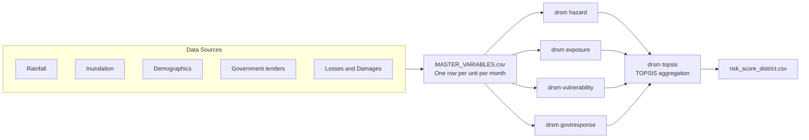

# Intelligent Data Solution for Disaster Risk Reduction (IDS-DRR)

**An open-source model based on the Sendai DRR framework for computing flood risk scores from publicly available data.**

[](https://www.gnu.org/licenses/agpl-3.0)
[](https://www.python.org/downloads/)
[](#status)

---

## Overview

Data that could enable more effective disaster-risk response and management is scattered or siloed across different agencies, at different scales and formats, making it difficult for decision-makers and relevant stakeholders to make data-informed decisions. The availability of good quality, machine-readable, and interoperable data is crucial for effective climate action and disaster response. However, in many contexts this data is fragmented across agencies, making timely, data-informed decisions difficult.

This repository contains the **risk-score model** of the IDS-DRR pipeline: a configurable system that combines climate, infrastructure access, losses & damages, procurement, and demographic data into a single composite flood risk score at district and sub-district (block/tehsil) levels. It is designed to be adapted to any geography for which the required input variables are available.

Originally developed for the state of Assam, India, this generic version of the codebase abstracts geography- and source-specific assumptions into configuration files so that the same scripts can be applied to other states, regions, or countries.

For programme background and methodological discussion, see the [project report](https://docs.google.com/document/d/12oSX3kltlaq1Wvxkc7GRjBkGbxu8hwpyASss7yB2dmc/edit?usp=sharing).

---

## Relevance to the Sustainable Development Goals

This work directly supports:

- **SDG 13 — Climate Action**, especially target 13.1 (strengthen resilience and adaptive capacity to climate-related hazards) and indicator 13.1.1 (number of people affected by disasters).
- **SDG 11 — Sustainable Cities and Communities**, especially target 11.5 (reduce deaths and economic losses caused by disasters) and target 11.b (integrated policies for resilience to disasters).

By producing transparent, reproducible risk scores at granular administrative levels, the project enables agencies to plan mitigation, target relief, and audit historical response patterns against measured exposure and vulnerability.

---

## What this repository contains

```
risk-score-model-generic/
├── src/disaster_risk_score_model/   Installable library: factor + TOPSIS modules,
│                                    CLI, config loader, bundled config templates
├── tests/               Automated tests (pytest)
├── docs/                Methodology documentation + data dictionary
├── contrib/             Region-specific tooling and examples
│   └── india/
│       ├── maps/        India admin-boundary download and transformation scripts
│       └── example/     India (Assam) reference configuration and dataset
│
├── pyproject.toml       Package metadata, dependencies, `drsm` entry point
├── CITATION.cff         Citation metadata
├── LICENSE              GNU AGPL v3.0
├── README.md
├── requirements.txt     `-e .` (deps live in pyproject.toml)
└── requirements-dev.txt `-e .[dev]` (adds test tooling)
```

The model is **geography-neutral**: there is no committed config or input data at
the root. `drsm init-config` scaffolds an editable, geography-neutral config and
`drsm generate-sample-data` writes a synthetic input, so the model runs out of the
box on any machine. A complete real-world configuration — the deployment the model
was built for — lives under [`contrib/india/example/`](contrib/india/example/).

This repository covers the **modelling layer** only. Data acquisition is handled by a companion repository — see [Data inputs](#data-inputs-and-the-flood-data-ecosystem) below.

---

## Architecture



The four **factor steps** (`drsm hazard`, `drsm exposure`, `drsm vulnerability`, `drsm govtresponse`) are independent and can run in any order; `drsm run` runs all four and then TOPSIS. The **TOPSIS step** combines their outputs into a single composite risk score weighted by hazard, exposure, vulnerability, and government response.

For a step-by-step walkthrough — including the input schema, configuration options, and per-script methodology — start with [`docs/getting_started.md`](docs/getting_started.md).

---

## Quick start

### Prerequisites

- Python 3.11 or later
- pip and a virtual-environment tool of your choice

### Install

```bash
git clone https://github.com/CivicDataLab/risk-score-model-generic.git
cd risk-score-model-generic
python -m venv .venv
source .venv/bin/activate          # Windows: .venv\Scripts\activate
pip install -e .                   # add the [dev] extra for the test tooling: pip install -e .[dev]
```

Installing the package puts the `drsm` command on your `PATH`.

### Run the model with synthetic sample data

```bash
drsm init-config ./config        # scaffold an editable config (scores_config.toml + topsis_config.toml)
drsm generate-sample-data        # write a synthetic data/MASTER_VARIABLES.csv + district lookup
drsm run                         # all four factors, then TOPSIS
```

`drsm run` reads `data/MASTER_VARIABLES.csv` and writes the factor scores and the final composite `data/risk_score_district.csv` under `data/`. Each step is also runnable on its own (`drsm hazard`, `drsm exposure`, …, `drsm topsis`).

**Where things live** is controlled by the CLI, not the config:

- `--config-dir DIR` (or `RISK_MODEL_CONFIG_DIR`, else `./config`) — the config directory.
- `--data-dir DIR` (or `RISK_MODEL_DATA_DIR`, else `./data`) — inputs and outputs.
- `--input-file NAME` (or `RISK_MODEL_INPUT_FILE`, else `MASTER_VARIABLES.csv`) — the master input filename.

To run the bundled **India (Assam) reference example** instead of the synthetic sample, point both at it:

```bash
drsm run --config-dir contrib/india/example/config --data-dir contrib/india/example/data
```

See [`contrib/india/example/`](contrib/india/example/) for details. To adapt the model to a new geography, follow [`docs/getting_started.md`](docs/getting_started.md).

---

## Configuration

`drsm init-config <dir>` writes two editable TOML files. The config describes
*what* your data is and *how* to score it; *where* files live is supplied at run
time via `--data-dir` / `--input-file` (see Quick start), not in the config.

| File | Section | Controls |
|------|---------|----------|
| `scores_config.toml` | `[columns]` | Shared column names (`object_id`, `timeperiod`, `district`) |
| | `[hazard.*]` | Hazard variables, quantile thresholds, output classes |
| | `[exposure.*]` | Exposure variables and class boundaries |
| | `[vulnerability.*]` | DEA input/output variables and polarity inversions |
| | `[govtresponse.*]` | Response variables and fiscal-year start month |
| `topsis_config.toml` | `[weights]`, `[classification]` | Factor weights and risk-class bins (required) |
| | `[indicators]`, `[rounding]`, `[cumulative_vars]`, `[derivations]`, `[renames]` | Optional district-output enrichment |

Adapting the model to a new geography is mostly a matter of editing these TOMLs to match your input data. Code changes are needed only when adding new factor variables or modifying the methodology.

---

## Documentation

| Document | Contents |
|----------|----------|
| [`getting_started.md`](docs/getting_started.md) | End-to-end guide for adapting the model to a new geography |
| [`score_hazard.md`](docs/score_hazard.md) | Flood Hazard methodology |
| [`score_exposure.md`](docs/score_exposure.md) | Exposure methodology |
| [`score_vulnerability.md`](docs/score_vulnerability.md) | Vulnerability methodology (DEA) |
| [`score_government_response.md`](docs/score_government_response.md) | Government Response methodology |
| [`topsis_risk_score.md`](docs/topsis_risk_score.md) | TOPSIS composite score and final output |
| [`dpg.md`](docs/dpg.md) | How the project maps to the Digital Public Goods Standard |
| [`contrib/india/example/`](contrib/india/example/) | India (Assam) reference configuration and dataset |
| [`contrib/india/maps/`](contrib/india/maps/) | admin-boundary download and transformation tooling for India |

---

## Data inputs and the Flood Data Ecosystem

The model consumes a single tabular file (`MASTER_VARIABLES.csv`) — one row per geographic unit per month. Each row carries the variables needed by the four factor scripts (rainfall, inundation, population, infrastructure, damages, expenditure).

The acquisition, cleaning, and joining of those variables is geography-specific. For the original India deployment it is handled by a companion repository:

➡️ **[CivicDataLab/flood-data-ecosystem-generic](https://github.com/CivicDataLab/flood-data-ecosystem-generic)**

That repository contains per-source extractors for the data sources used by the **India example** — the Indian Meteorological Department (IMD), ISRO Bhuvan, WorldPop, NASADEM, Mission Antyodaya, BharatMaps, WRIS, and government tender portals. Its output is a master CSV in the shape this model consumes. Adopters in other geographies supply their own equivalent sources; the model itself is agnostic to where the variables come from.

For testing and demonstration, `drsm generate-sample-data` writes a small **synthetic** sample dataset into the data directory so the model can be run end-to-end without any real data pipeline. A real-world Assam dataset is available under [`contrib/india/example/`](contrib/india/example/).

---

## Data extraction and interoperability

All inputs and outputs use non-proprietary, machine-readable formats:

- **Tabular data** — CSV (UTF-8) with documented schemas
- **Geometries** — GeoJSON in EPSG:4326 (WGS 84)
- **Configuration** — TOML
- **Documentation** — Markdown

Output columns and their semantics are documented inline in each methodology document and summarised in [`docs/data_dictionary.csv`](docs/data_dictionary.csv).


---

## Citation

If you use this work in research or operational practice, please cite it. A `CITATION.cff` file is included for reference managers; in plain text:

> CivicDataLab. (2026). *Intelligent Data Solution for Disaster Risk Reduction — Risk Score Model (Generic)*. https://github.com/CivicDataLab/risk-score-model-generic

---

## License

All source code in this repository is licensed under the **GNU Affero General Public License v3.0** (AGPL-3.0). The full license text is in [`LICENSE`](LICENSE).

[](LICENSE)

Sample and derived datasets included in this repository are released under the **Creative Commons Attribution 4.0 International** license (CC-BY 4.0), unless a more restrictive licence applies to a specific upstream source (in which case the upstream licence governs that file).

---

## Status

This repository is in **beta**. The Assam-specific deployment is in production at scale; the generic refactor that lives here is being validated against new geographies. Interface and configuration schemas may still change between minor versions.

---

## Contact

CivicDataLab · <info@civicdatalab.in> · https://civicdatalab.in