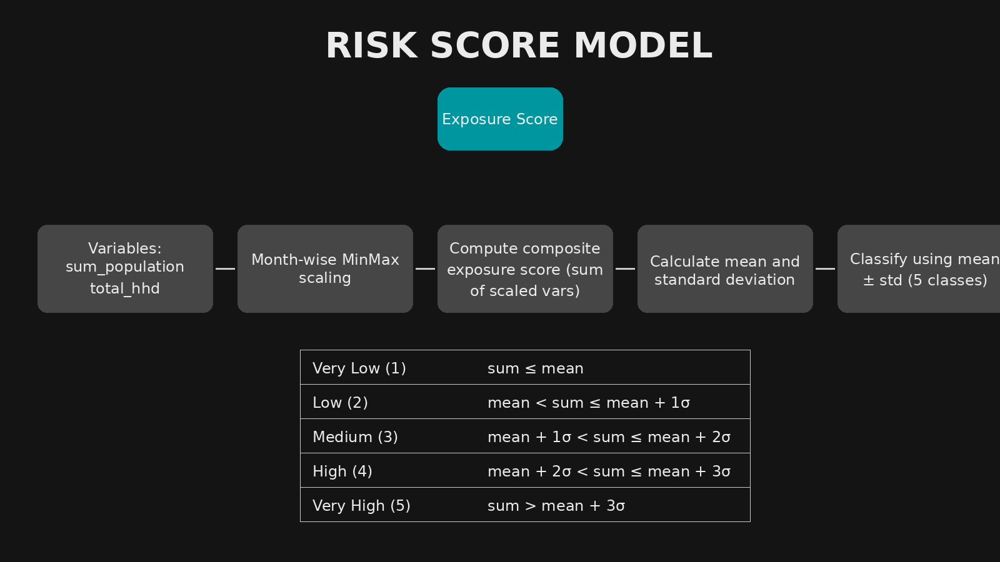
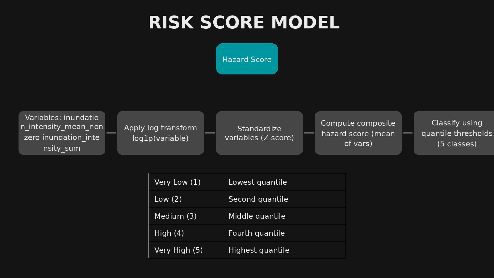
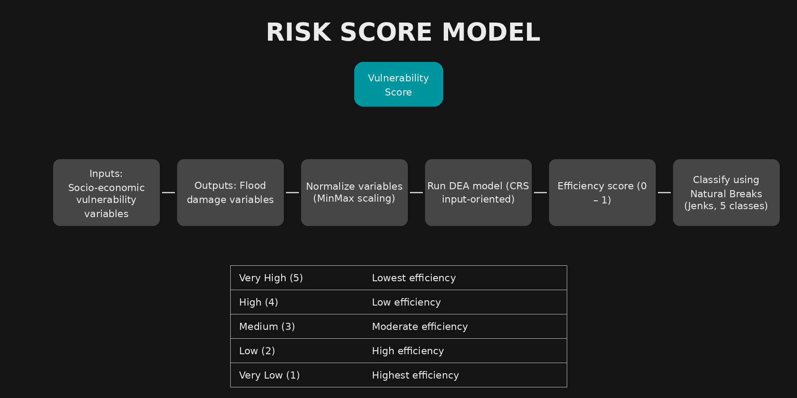
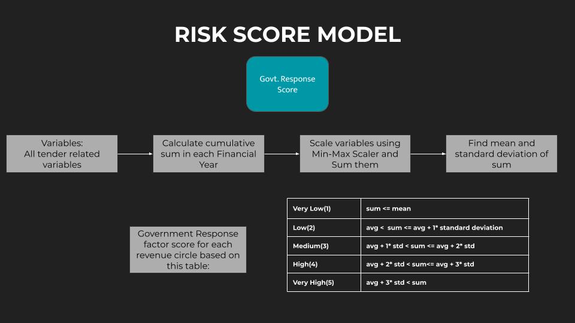
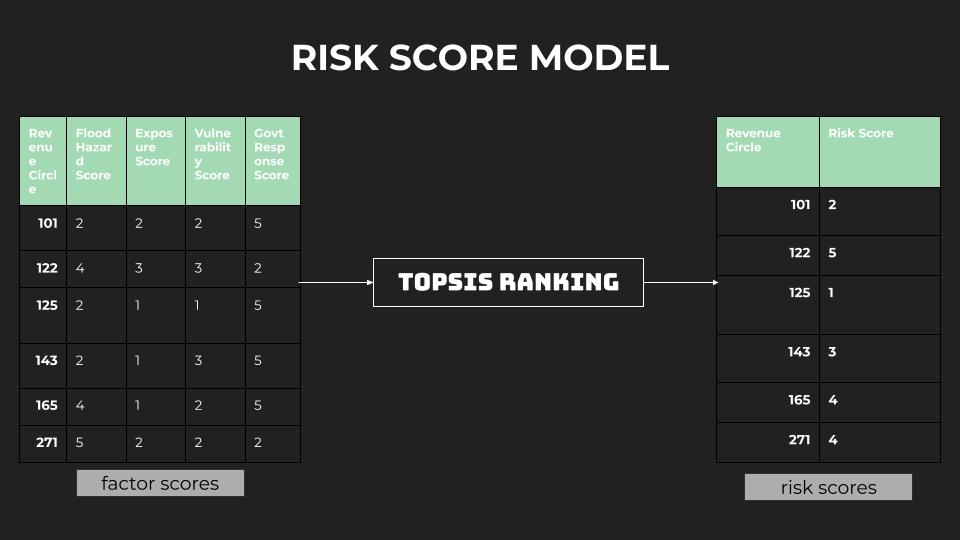
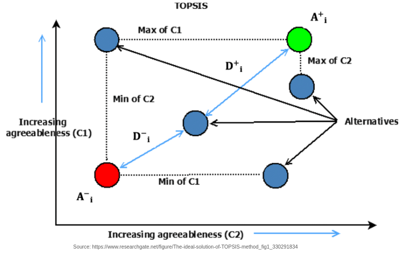

# Risk Score Model

Once the data variables are created from all data sources, these are used to calculate `Risk score` for each revenue circle.

IDS-DRR defines `Risk` as the combination of **factors** `Flood Hazard`, `Vulnerability`, `Exposure` and `Government Response`

Variables are used to model each of these `factor scores` at first. The factor scores are then used to model the comprehensive `Risk Score`.

## Calculation of Factor Scores

### Exposure

1. `sum_population` and `total_hhd` variables are considered for the calculation. (add other variables as required)
2. Use min_max scaler to scale these variables for each month.
3. Sum the scaled variables of `sum_population` and `total_hhd`
4. Find mean and standard deviation of the sum calculated above.
5. Then find the `exposure` factor score using the following criteria:

    - If sum <= mean => very low(1) 
    - mean to mean+1std => low(2)
    - mean+1std to mean+2std => medium(3)
    - mean+2std to mean+3std => high(4)
    - sum > mean+3std => very high(5)

`exposure.py` is the code that runs above steps.

Input -- `MASTER_VARIABLES.csv`

Output -- `factor_scores_l1_exposure.csv`

### Flood Hazard

1. `inundation_intensity_mean_nonzero`, `inundation_intensity_sum`, `drainage_density`, `max_rain` and `mean_rain` variables are considered for the calculation.  Other variables as required can be added.

2. Using the following table, calculate class for both these variables, for each revenue circle in each month.

- If sum <= mean => very low(1) 
- mean to mean+1std => low(2)
- mean+1std to mean+2std => medium(3)
- mean+2std to mean+3std => high(4)
- sum > mean+3std => very high(5)

3. Take average of both the classes thus calculated.
4. Then find the `exposure` factor score by rounding the average.

`hazard.py` is the code that runs above steps.

Input -- `MASTER_VARIABLES.csv`

Output -- `factor_scores_l1_hazard.csv`

### Vulnerability

Losses and Damages data is generally not available for disaster risk assessments. But when available, DRR literature suggests that it be used in the assessment of Vulnerability of the region [3][4]

[Assam State Disaster Management Authority (ASMDA)](sdmassam.nic.in) has been collecting data on flood related damages through a system called FRIMS. We used this damages data along with data on socio-economic vulnerability to assess disaster vulnerability of each revenue circle in Assam. 

For this, we leveraged a method called Data Envelopment Analysis (DEA)

DEA basically takes certain input variables and output variables for each decision making unit (Revenue Circle, in our case). And then DEA calculates `Efficiency` for each decision making unit. We used this approach in the following way:

1. Variables on socio-economic vulnerability are considered as Inputs.
2. Variables on damages are considered as Outputs.
3. `Efficiency` is interpreted this way: If a revenue circle has high socio-economic vulnerability but has not seen disaster related damages, it would get high efficiency score by DEA model. Revenue Circles with less efficiency are interpreted as regions with high vulnerability.
4. This efficiency is between 0-1. It is binned into 5 categories using Natural Breaks method -- From Very High Vulnerability to Very Low Vulnerability. These five categories constitute the `vulnerability` score.

`vulnerability.py` is the code that runs above steps.

Input -- `MASTER_VARIABLES.csv`

Output -- `factor_scores_l1_vulnerability.csv`

### Government Response

1. Tender variables (total sum and SDRF tenders) variables are considered for the calculation. (Other variables as required can be added)
2. Calculate cumulative sum of money spent in each Financial Year.
2. Use min_max scaler to scale these variables for each month.
3. Sum all the scaled variables
4. Find mean and standard deviation of the sum calculated above.
5. Then find the `government-response` factor score using the following criteria:

    - If sum <= mean => very low(1) 
    - mean to mean+1std => low(2)
    - mean+1std to mean+2std => medium(3)
    - mean+2std to mean+3std => high(4)
    - sum > mean+3std => very high(5)

`govtresponse.py` is the code that runs above steps.

Input -- `MASTER_VARIABLES.csv`

Output -- `factor_scores_l1_government-response.csv`

## Calculation of Risk-Score using TOPSIS

Once the factor scores are calculated for each revenue circle, we use these factor scores to calculate the comprehensive risk-score for each revenue circle. We use TOPSIS for this.

`topsis.py` is the Python module that implements TOPSIS. 
`topsis_riskscore.py` is the code that uses the above module to calculate risk score.

TOPSIS requires a weight to each factor. We've considered the following weights based on literature survey

| Factor   | Weight |
| -------- | ------- |
| Flood Hazard  | 4    |
| Vulnerability | 2     |
| Government Response    | 2    |
| Exposure    | 1   |

Output -- `risk_score_final.csv`

This is the inner mechanism of TOPSIS:

## References
1. [What is TOPSIS? - By Robert Soczewica](https://robertsoczewica.medium.com/what-is-topsis-b05c50b3cd05)
2. [DEA Pythonic Implementation](https://github.com/wurmen/DEA/tree/master/Functions/basic_DEA_data%26code)
3. [Aqueduct 4.0: Updated decision-relevant global water risk indicators](https://www.wri.org/research/aqueduct-40-updated-decision-relevant-global-water-risk-indicators)
4. [Flood risk assessment at different spatial scales](https://link.springer.com/article/10.1007/s11027-015-9654-z)