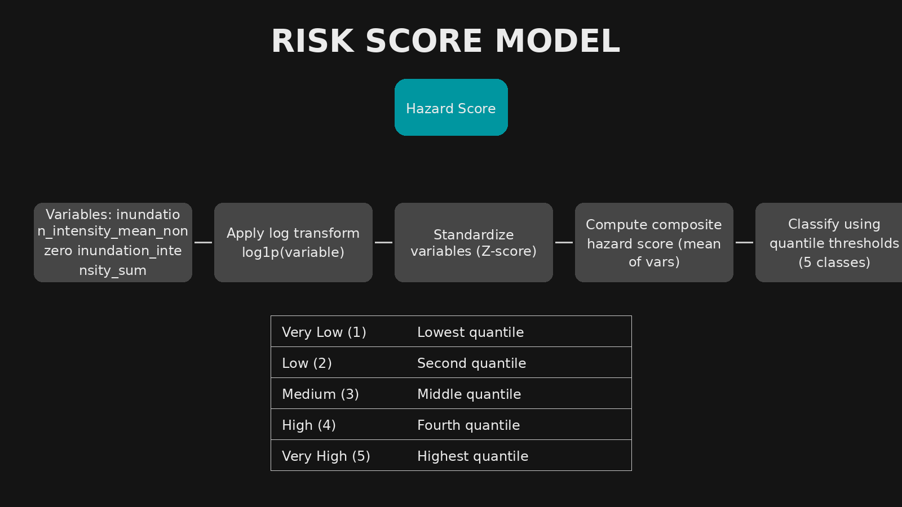
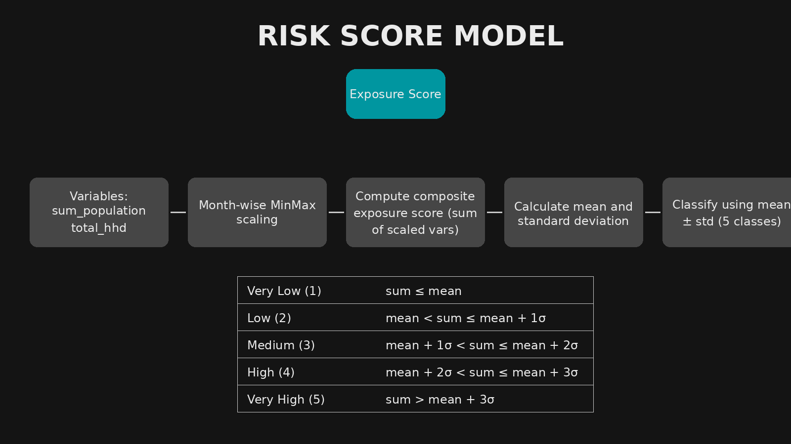
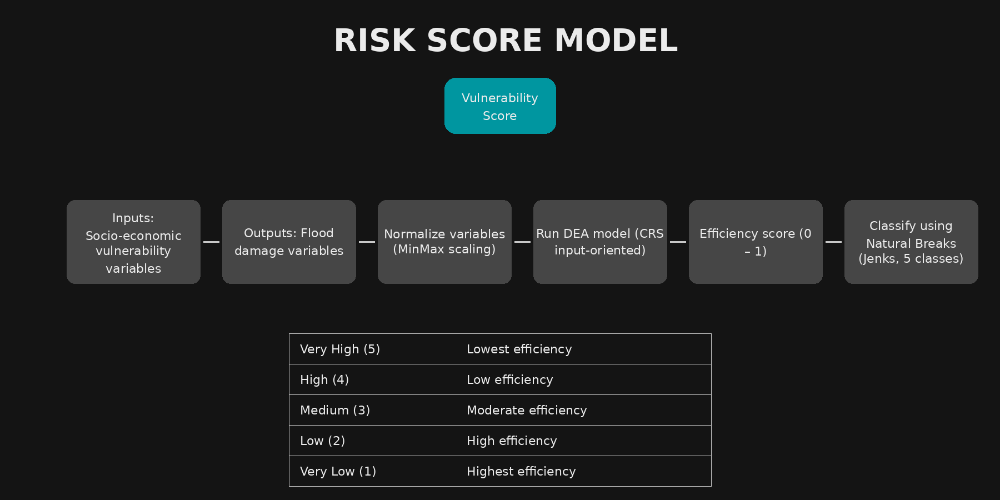
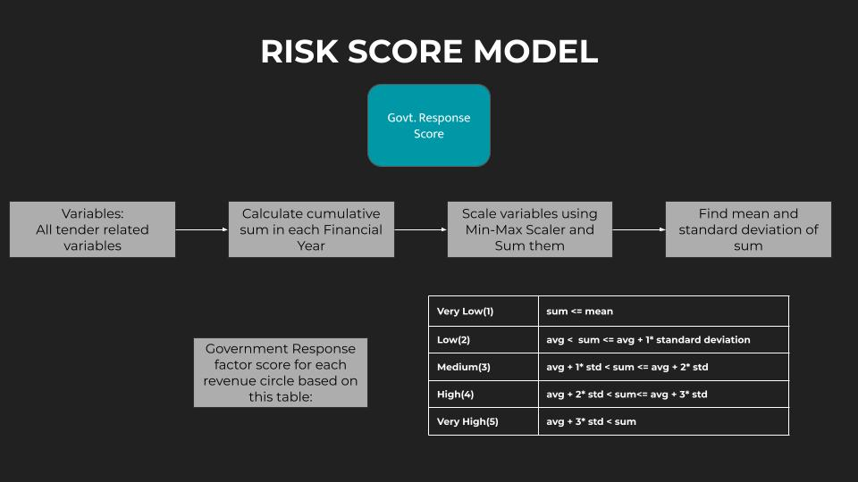
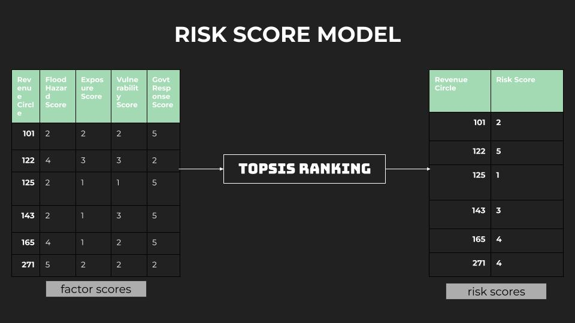

# Risk Score Model

A configuration-driven flood risk modeling framework that computes composite **Risk Scores** for each Revenue Circle using:

- Flood Hazard  
- Exposure  
- Vulnerability (DEA-based)  
- Government Response  

The final composite score is calculated using **TOPSIS**.

---

## Overview

Risk is defined as:

> **Risk = f (Flood Hazard, Vulnerability, Exposure, Government Response)**

Each factor is calculated independently from `MASTER_VARIABLES.csv`, and then combined using weighted multi-criteria decision analysis.

The model is:

- Modular  
- Month-wise processed  
- Fully configuration-driven  
- Scalable  

---

# 1️⃣ Flood Hazard

**Script:** `scripts/hazard.py`  
**Config:** `config/hazard_config.py`  

### Method

- Log transformation (`log1p`)
- Z-score standardization
- Composite score (mean of standardized variables)
- Quantile-based classification

**Output:** `factor_scores_l1_flood-hazard.csv`

---

# 2️⃣ Exposure

**Script:** `scripts/exposure.py`  
**Config:** `config/exposure_config.py`  

### Method

- Month-wise MinMax scaling
- Composite score (sum of scaled variables)
- Classification using mean–standard deviation thresholds

| Condition | Class |
|------------|--------|
| sum ≤ mean | 1 |
| mean < sum ≤ mean + 1σ | 2 |
| mean + 1σ < sum ≤ mean + 2σ | 3 |
| mean + 2σ < sum ≤ mean + 3σ | 4 |
| sum > mean + 3σ | 5 |

**Output:** `factor_scores_l1_exposure.csv`

---

# 3️⃣ Vulnerability (DEA-Based)

**Script:** `scripts/vulnerability.py`  
**Config:** `config/vulnerability_config.py`  
**DEA Engine:** `scripts/data_models/DEA.py`

### Method

1. Per-capita normalization using `PER_CAPITA_MAP`
2. Month-wise MinMax scaling
3. Reverse inputs defined in `REVERSE_INPUT_VARS`
4. Damage weighting using `landd_score`
5. Input-oriented CRS DEA
6. Natural Jenks classification (5 classes)

**Interpretation:**

- Higher efficiency → Lower vulnerability  
- Lower efficiency → Higher vulnerability  

**Output:** `factor_scores_l1_vulnerability.csv`

---

# 4️⃣ Government Response

**Script:** `scripts/government_response.py`  
**Config:** `config/govtresponse_config.py`

### Method

- Financial year cumulative expenditure
- Month-wise MinMax scaling
- Composite score (sum)
- Mean–standard deviation classification

| Condition | Class |
|------------|--------|
| sum ≤ mean | 1 |
| mean < sum ≤ mean + 1σ | 2 |
| mean + 1σ < sum ≤ mean + 2σ | 3 |
| mean + 2σ < sum ≤ mean + 3σ | 4 |
| sum > mean + 3σ | 5 |

**Output:** `factor_scores_l1_government-response.csv`

---

# Final Risk Score (TOPSIS)

**Script:** `scripts/risk_score.py`  
**Engine:** `scripts/data_models/topsis.py`

### Weights

| Factor | Weight |
|--------|--------|
| Flood Hazard | 4 |
| Vulnerability | 2 |
| Government Response | 2 |
| Exposure | 1 |

**Outputs:**

- `risk_score.csv`
- `risk_score_final_district.csv`

---

# Project Structure
risk-score-model-generic/
│
└── RiskScoreModel/
    │
    ├── config/
    │   ├── base_config.py
    │   ├── exposure_config.py
    │   ├── hazard_config.py
    │   ├── vulnerability_config.py
    │   ├── government_response_config.py
    │   └── risk_score_config.py
    │
    ├── scripts/
    │   ├── exposure.py
    │   ├── hazard.py
    │   ├── vulnerability.py
    │   ├── government_response.py
    │   ├── risk_score.py
    │   └── data_models
    │      ├── DEA.py
    │      └── topsis.py
    ├── data/
    │   └── MASTER_VARIABLES.csv
    │   └── (OUTPUT).csv 
    │
    ├── assets/
    │   └── district_objectid.csv
    │
    └── docs/
    
# Running the Scripts
1. Set Working Directory: Navigate to the 'RiskScoreModel' directory before running any scripts.
2. Script Execution Order:
    1. python scripts/hazard.py
    2. python scripts/exposure.py
    3. python scripts/vulnerability.py
    4. python scripts/government_response.py
    5. python scripts/risk_score.py

# Required Input Files
    1. data/MASTER_VARIABLES.csv
    2. assets/district_objectid.csv
    
# Output Files
    data/
    │
    ├── factor_scores_l1_flood-hazard.csv
    ├── factor_scores_l1_exposure.csv
    ├── factor_scores_l1_vulnerability.csv
    ├── factor_scores_l1_government-response.csv
    │
    ├── risk_score.csv
    └── risk_score_final_district.csv

# References
1. [What is TOPSIS? - By Robert Soczewica](https://robertsoczewica.medium.com/what-is-topsis-b05c50b3cd05)
2. [DEA Pythonic Implementation](https://github.com/wurmen/DEA/tree/master/Functions/basic_DEA_data%26code)
3. [Aqueduct 4.0: Updated decision-relevant global water risk indicators](https://www.wri.org/research/aqueduct-40-updated-decision-relevant-global-water-risk-indicators)
4. [Flood risk assessment at different spatial scales](https://link.springer.com/article/10.1007/s11027-015-9654-z)
