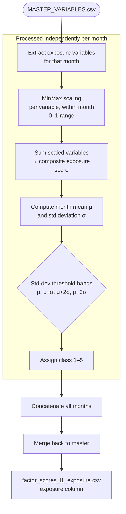

# Exposure Score — Methodology

**Script:** `RiskScoreModel/scripts/exposure.py`
**Input:** `RiskScoreModel/data/MASTER_VARIABLES.csv`
**Output:** `RiskScoreModel/data/factor_scores_l1_exposure.csv`
**Output column added:** `exposure` (integer 1–5)

---

## Purpose

The Exposure score classifies each geographic unit for each month on a 1–5 scale representing the size of the population and household base exposed to flood risk. Units with larger populations and more households are considered more exposed, regardless of the physical flood conditions (which are captured in the Hazard score).

**Score interpretation:** 1 = Very Low exposure, 5 = Very High exposure.

---

## Methodology Overview



---

## Step-by-Step Computation

### Step 1 — MinMax Scaling (per month)

Each exposure variable is scaled to [0, 1] within the current month's data:

```
scaled[var] = (raw[var] − min(raw[var])) / (max(raw[var]) − min(raw[var]))
```

Scaling is applied **independently per month**, so each month's distribution is self-normalised.

### Step 2 — Composite Score

The scaled variables are summed to produce a composite exposure index:

```
composite = sum(scaled[var₁], scaled[var₂], ..., scaled[varₙ])
```

### Step 3 — Standard Deviation Classification

The composite score is classified using the month's mean (μ) and standard deviation (σ):

| Class | Condition |
|-------|-----------|
| 1 (Very Low) | composite ≤ μ |
| 2 (Low) | μ < composite ≤ μ + σ |
| 3 (Medium) | μ + σ < composite ≤ μ + 2σ |
| 4 (High) | μ + 2σ < composite ≤ μ + 3σ |
| 5 (Very High) | composite > μ + 3σ |

This produces a **right-skewed classification** where most units fall in classes 1–2 and only a small number of densely populated units reach class 5, which reflects realistic population distribution patterns.

---

## Input Variable Requirements

| Column | Description | Minimum Requirement |
|--------|-------------|---------------------|
| `sum_population` | Total estimated population in the unit | Any population count (census, modelled) |
| `total_hhd` | Total number of households in the unit | Any household count |

**Minimum viable configuration:** 1 variable is sufficient; the model works with any combination of population-type measures.

### Adapting to Different Data Sources

| Variable | Alternative sources acceptable |
|----------|-------------------------------|
| `sum_population` | WorldPop, GPWv4, census block statistics, GHSL population grid, LandScan |
| `total_hhd` | National census household tables, Antyodaya survey HHD counts, proxy derived from population / average household size |

**Note on normalisation:** Because MinMax scaling is applied per month and the classification uses relative std-dev bands, the absolute units of the input variables do not matter — only the relative spatial distribution within a month.

---

## Output Schema

**File:** `factor_scores_l1_exposure.csv`

Contains all columns from `MASTER_VARIABLES.csv` plus:

| Column | Type | Description |
|--------|------|-------------|
| `exposure` | Integer (1–5) | Exposure class; 1 = Very Low, 5 = Very High |
