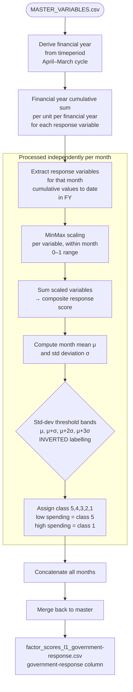

# Government Response Score — Methodology

**Script:** `RiskScoreModel/scripts/govtresponse.py`
**Input:** `RiskScoreModel/data/MASTER_VARIABLES.csv`
**Output:** `RiskScoreModel/data/factor_scores_l1_government-response.csv`
**Output column added:** `government-response` (integer 1–5)

---

## Purpose

The Government Response score classifies each geographic unit for each month on a 1–5 scale representing the cumulative level of government procurement and financial mobilisation in response to floods. Higher spending on flood-related tenders and disaster response funds within a financial year is treated as a **positive** response signal. The score is **inversely coded** relative to risk: higher procurement = class 1 (better response), lower procurement = class 5 (weaker response).

**Score interpretation:** 1 = Strong response (most spending), 5 = Weak response (least spending).

This inversion reflects that government response **mitigates** risk — it is the only factor in the TOPSIS model where "more is better" for risk reduction.

---

## Methodology Overview



---

## Step-by-Step Computation

### Step 1 — Financial Year Derivation

A financial year label is computed from the `timeperiod` column. In the Indian fiscal calendar (April–March):

```
if month >= 4:  financial_year = YYYY–(YYYY+1)
else:           financial_year = (YYYY–1)–YYYY
```

Example: `2022_07` → `2022–2023`; `2023_02` → `2022–2023`

> Adapt this logic if the target geography uses a different fiscal year convention.

### Step 2 — Financial Year Cumulative Sum

For each combination of geographic unit and financial year, a **running cumulative sum** is computed for each response variable:

```
cumulative_value[unit, month] = sum of monthly values from April to current month within FY
```

This ensures the response score reflects total accumulated investment within the current fiscal year up to that month, not just the single month's procurement. This is important because flood response tenders are awarded irregularly and a single month may show zero activity.

### Step 3 — MinMax Scaling (per month)

Each response variable (with cumulative values) is scaled to [0, 1] within the month across all geographic units:

```
scaled[var] = (cumulative[var] − min) / (max − min)
```

### Step 4 — Composite Score

Scaled variables are summed:

```
composite = sum(scaled[var₁], scaled[var₂], ..., scaled[varₙ])
```

### Step 5 — Inverted Standard Deviation Classification

The composite score is binned using mean (μ) and standard deviation (σ), but with **inverted labels** so that low spending = high risk class:

| Condition | Class |
|-----------|-------|
| composite ≤ μ | 5 (Weakest response) |
| μ < composite ≤ μ + σ | 4 |
| μ + σ < composite ≤ μ + 2σ | 3 |
| μ + 2σ < composite ≤ μ + 3σ | 2 |
| composite > μ + 3σ | 1 (Strongest response) |

---

## Input Variable Requirements

| Column | Description | Minimum Requirement |
|--------|-------------|---------------------|
| `total_tender_awarded_value` | Total value of all flood-related contracts awarded | Any measure of total disaster-related procurement spending |
| `SDRF_sanctions_awarded_value` | Value of SDRF (State Disaster Response Fund) sanctions | Disaster fund disbursements or equivalent earmarked spending |
| `SDRF_tenders_awarded_value` | Value of contracts funded via SDRF scheme | Scheme-specific procurement values (optional; can be omitted) |

**Minimum viable configuration:** A single variable representing total government flood expenditure is sufficient. The model works with any combination of monetary spending variables.

### Adapting to Different Data Sources

The key requirement is **monetary value of government disaster-related expenditure or procurement**, aggregated to the geographic unit and month. Acceptable alternatives include:

| Accepted data type | Examples |
|--------------------|---------|
| Public procurement (OCDS-format or flat CSV) | National/state e-procurement portals, open contracting data |
| Government budget disbursements | PFMS (India), treasury systems, finance ministry open data |
| Disaster fund releases | SDRF, NDRF releases; FEMA grants; UN CERF allocations |
| Departmental expenditure reports | PWD, irrigation, agriculture department spend reports |

**Data standard:** OCDS (Open Contracting Data Standard) is preferred for structured procurement data, but a flat CSV with the required columns (geographic unit, month, awarded value) is equally valid after the data transformation step.

**Geographic attribution:** Spending must be attributable to a specific geographic unit (block, district, etc.) through geocoding, procuring entity location, or delivery address. See `flood-data-ecosystem-generic/docs/01_government_response.md` for the geocoding methodology used in the reference implementation.

---

## Output Schema

**File:** `factor_scores_l1_government-response.csv`

Contains all columns from `MASTER_VARIABLES.csv` plus:

| Column | Type | Description |
|--------|------|-------------|
| `government-response` | Integer (1–5) | Response class; 1 = Strongest response, 5 = Weakest |
| `financial_year` | String | Derived fiscal year label (e.g., `2022-2023`) |
