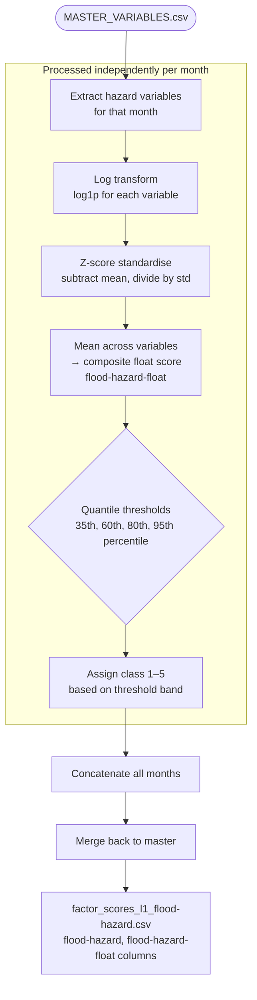

# Flood Hazard Score — Methodology

**Script:** `RiskScoreModel/scripts/hazard.py`
**Config:** `RiskScoreModel/config/hazard_config.py`
**Input:** `RiskScoreModel/data/MASTER_VARIABLES.csv`
**Output:** `RiskScoreModel/data/factor_scores_l1_flood-hazard.csv`
**Output columns added:** `flood-hazard` (integer 1–5), `flood-hazard-float` (continuous)

---

## Purpose

The Flood Hazard score classifies each geographic unit for each month on a 1–5 scale representing the intensity of flood conditions. It combines rainfall, inundation, and drainage indicators into a single composite score using statistical normalisation and quantile-based classification.

**Score interpretation:** 1 = Very Low hazard, 5 = Very High hazard.

---

## Methodology Overview



---

## Step-by-Step Computation

### Step 1 — Log Transform

Each hazard variable is log-transformed to reduce skewness:

```
transformed[var] = log(1 + raw[var])
```

`log1p` is used to safely handle zero values.

### Step 2 — Z-Score Standardisation

Each log-transformed variable is standardised within the month:

```
z[var] = (transformed[var] − mean(transformed[var])) / std(transformed[var])
```

This puts all variables on a common scale before compositing.

### Step 3 — Composite Score

The mean of all standardised variables gives the composite hazard float:

```
flood-hazard-float = mean(z[var₁], z[var₂], ..., z[varₙ])
```

### Step 4 — Quantile Classification

The float score is binned into 5 hazard classes using fixed quantile thresholds computed within each month:

| Class | Threshold |
|-------|-----------|
| 1 (Very Low) | ≤ 35th percentile |
| 2 (Low) | > 35th and ≤ 60th percentile |
| 3 (Medium) | > 60th and ≤ 80th percentile |
| 4 (High) | > 80th and ≤ 95th percentile |
| 5 (Very High) | > 95th percentile |

> Thresholds are configurable in `hazard_config.py` (`QUANTILE_THRESHOLDS`).

---

## Input Variable Requirements

The following columns must be present in `MASTER_VARIABLES.csv`. All must be **non-negative floats** (log-transform requires values ≥ 0).

| Column | Description | Minimum Requirement |
|--------|-------------|---------------------|
| `inundation_intensity_mean_nonzero` | Mean inundation intensity for inundated pixels only | Any measure of flood water extent/depth (0–1 normalised preferred) |
| `inundation_intensity_sum` | Sum of inundation intensity across the unit | Any cumulative flood exposure measure |
| `drainage_density` | Stream/channel length per unit area | km/km² or equivalent |
| `mean_rain` | Mean rainfall in the unit | mm or consistent unit |
| `max_rain` | Maximum rainfall pixel value in the unit | mm or consistent unit |

**Minimum viable configuration:** Any 2+ of these variables. Update `hazard_config.py → HAZARD_VARS` to match available columns.

### Adapting to Different Data Sources

| Variable | Alternative sources acceptable |
|----------|-------------------------------|
| Rainfall | GPM IMERG, CHIRPS, ERA5, national met agency gridded data |
| Inundation | JRC Global Surface Water, MODIS flood products, SAR-derived maps (Sentinel-1, ALOS), hydrological model output |
| Drainage density | OpenStreetMap waterways, national hydrographic datasets, SRTM-derived drainage network |

The key constraint is that all variables must be spatially aggregated to the same geographic unit and temporal period as the rest of `MASTER_VARIABLES.csv`.

---

## Configuration

Edit `RiskScoreModel/config/hazard_config.py` to adapt the model:

| Parameter | Default | Description |
|-----------|---------|-------------|
| `HAZARD_VARS` | `[inundation_intensity_mean_nonzero, inundation_intensity_sum, drainage_density, mean_rain, max_rain]` | List of input variable column names |
| `QUANTILE_THRESHOLDS` | `[0.35, 0.60, 0.80, 0.95]` | Percentile cut-points for classification |
| `HAZARD_CLASSES` | `[1, 2, 3, 4, 5]` | Output class labels |

---

## Output Schema

**File:** `factor_scores_l1_flood-hazard.csv`

Contains all columns from `MASTER_VARIABLES.csv` plus:

| Column | Type | Description |
|--------|------|-------------|
| `flood-hazard` | Integer (1–5) | Hazard class; 1 = Very Low, 5 = Very High |
| `flood-hazard-float` | Float | Continuous composite score (z-score scale) |

---

## Validation

The script runs automatic validation checks after classification:

- All 5 classes are present
- Class values are in range [1, 5]
- Distribution is decreasing (more low-risk units than high-risk)
- No missing values in the classification column

A diagnostic plot (bar chart + box plot) is saved to `data/hazard_distribution.png`.
