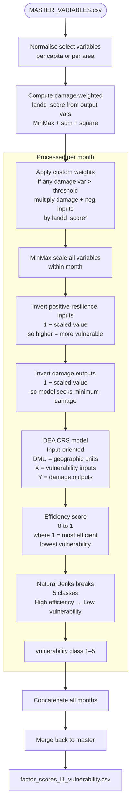

# Vulnerability Score — Methodology

**Script:** `RiskScoreModel/scripts/vulnerability.py`
**Dependencies:** `RiskScoreModel/scripts/DEA.py` (Data Envelopment Analysis)
**Input:** `RiskScoreModel/data/MASTER_VARIABLES.csv`
**Output:** `RiskScoreModel/data/factor_scores_l1_vulnerability.csv`
**Output columns added:** `vulnerability` (integer 1–5), `efficiency` (float 0–1), `landd_score`

---

## Purpose

The Vulnerability score classifies each geographic unit on a 1–5 scale representing its structural capacity to withstand and recover from flood impacts. Unlike simple index aggregation, this model uses **Data Envelopment Analysis (DEA)** to estimate relative efficiency: how well a unit's structural inputs (infrastructure, services, demographics) translate into low flood damage outcomes (outputs). Less efficient units — where poor conditions co-occur with high damage — receive higher vulnerability scores.

**Score interpretation:** 1 = Very Low vulnerability, 5 = Very High vulnerability.

---

## Methodology Overview



---

## Step-by-Step Computation

### Step 1 — Per-Capita and Per-Area Normalisation

Select variables are normalised before the DEA to make them comparable across units of different sizes:

| Variable | Normalisation |
|----------|---------------|
| `Population_affected_Total` | ÷ `sum_population` |
| `Human_Live_Lost` | ÷ `sum_population` |
| `Total_Animal_Affected` | ÷ `sum_population` |
| `Total_House_Fully_Damaged` | ÷ `sum_population` |
| `Crop_Area` | ÷ `net_sown_area_in_hac` |
| `Roads`, `Bridge`, `Embankment breached` | ÷ `block_area` (km²) |
| `sum_aged_population`, `rail_length`, `schools_count`, `health_centres_count`, `road_length` | ÷ `block_area` |

### Step 2 — Damage-Weighted Score (landd_score)

A composite damage score is computed to weight months/units where actual damage occurred:

```
landd_score = MinMax_sum(damage_vars) + 1
custom_weight = landd_score²
```

If any damage variable exceeds a threshold (0.0001), the damage variables and negative-polarity inputs are multiplied by `custom_weight`. This amplifies signal in damaged units, making the DEA more sensitive to real flood impact events.

### Step 3 — MinMax Scaling (per month)

All input and output variables are scaled to [0, 1] within the month.

### Step 4 — Variable Polarity Inversion

The DEA model assumes higher output = better performance. Variables where higher values mean **better resilience** are inverted so that the model correctly penalises their absence:

**Inverted inputs** (more = less vulnerable → invert so more = higher vulnerability input to DEA):
- `schools_count`, `health_centres_count`, `rail_length`, `road_length`
- `avg_electricity`, `rc_piped_hhds_pct`

**Non-inverted inputs** (more = more vulnerable, used directly):
- `mean_sex_ratio`, `rc_nosanitation_hhds_pct`, `sum_aged_population`, `Embankment breached`

**Damage outputs** are inverted (1 − value) so the DEA seeks units that minimise damage (i.e., low damage = high output = efficient).

### Step 5 — Data Envelopment Analysis (DEA / CRS)

DEA is a non-parametric linear programming method that compares each decision-making unit (DMU — here, a geographic block in a given month) against its peers.

- **Model:** CRS (Constant Returns to Scale), input-oriented
- **DMUs:** Each geographic unit in the month
- **Inputs (X):** The 11 vulnerability condition variables (inverted/adjusted)
- **Outputs (Y):** The 6 damage variables (inverted)
- **Result:** An `efficiency` score ∈ [0, 1] for each unit

An efficiency of **1.0** means the unit is on the efficient frontier — it has the best damage-to-conditions ratio among all peers. An efficiency **< 1** means the unit sustains more damage than peers with similar conditions, indicating higher vulnerability.

### Step 6 — Jenks Natural Breaks Classification

The continuous efficiency scores are classified into 5 vulnerability classes using **Jenks natural breaks** (Fisher-Jenks algorithm), which minimises within-class variance:

- Class assignment is **reversed**: high efficiency → low vulnerability (class 1); low efficiency → high vulnerability (class 5)
- If duplicate break edges are detected, the number of classes is reduced recursively

---

## Input Variable Requirements

### Vulnerability Condition Inputs

These represent structural characteristics of the unit:

| Column | Description | Polarity | Min. Requirement |
|--------|-------------|----------|-----------------|
| `mean_sex_ratio` | Females per 1,000 males | Higher → more vulnerable | Any sex-ratio or gender composition measure |
| `schools_count` | Schools per km² | Lower → more vulnerable (inverted) | Count or density of educational facilities |
| `health_centres_count` | Health centres per km² | Lower → more vulnerable (inverted) | Count or density of healthcare facilities |
| `rail_length` | Rail track length per km² | Lower → more vulnerable (inverted) | Any transport network density measure |
| `road_length` | Road length per km² | Lower → more vulnerable (inverted) | Road network density |
| `net_sown_area_in_hac` | Agricultural sown area | Context variable | Agricultural land statistics |
| `avg_electricity` | Electricity access score (0–1) | Lower → more vulnerable (inverted) | Any utility access measure |
| `rc_piped_hhds_pct` | % HHDs with piped water | Lower → more vulnerable (inverted) | Water access percentage |
| `rc_nosanitation_hhds_pct` | % HHDs without sanitation | Higher → more vulnerable | Sanitation deficit percentage |
| `sum_aged_population` | Elderly population per km² | Higher → more vulnerable | Age-structured population data |
| `Embankment breached` | Flood protection failures per km² | Higher → more vulnerable | Flood infrastructure damage count |

### Damage Output Variables

These represent observed flood impacts — used to calibrate the DEA:

| Column | Description | Min. Requirement |
|--------|-------------|-----------------|
| `Human_Live_Lost` | Deaths per capita (per month) | Flood-related mortality statistics |
| `Population_affected_Total` | Affected population per capita | Flood impact population data |
| `Crop_Area` | Damaged crop area / total sown area | Agricultural damage statistics |
| `Embankments affected` | Embankment damage per km² | Flood protection damage records |
| `Roads` | Road damage per km² | Infrastructure damage records |
| `Bridge` | Bridge damage per km² | Infrastructure damage records |

> **If damage data is not available:** The DEA approach requires observed damage to function correctly. In the absence of damage data, consider substituting with a simpler weighted index approach using only the condition variables.

### Adapting to Different Data Sources

| Variable category | Alternative sources |
|-------------------|---------------------|
| Population demographics | WorldPop age/sex, national census age tables |
| Infrastructure density | OpenStreetMap, national GIS datasets, BharatMaps, GADM |
| Socioeconomic indicators | DHS surveys, national census amenities tables, SDG tracking databases |
| Flood damage records | State disaster management authority reports, NDMA, PDNA data, EM-DAT |
| Agricultural area | National land use surveys, LULC remote sensing, FAO |

---

## Output Schema

**File:** `factor_scores_l1_vulnerability.csv`

Contains all columns from `MASTER_VARIABLES.csv` plus:

| Column | Type | Description |
|--------|------|-------------|
| `efficiency` | Float (0–1) | DEA efficiency score; 1 = most efficient (least vulnerable) |
| `landd_score` | Float | Composite damage weighting score |
| `vulnerability` | Integer (1–5) | Vulnerability class; 1 = Very Low, 5 = Very High |
