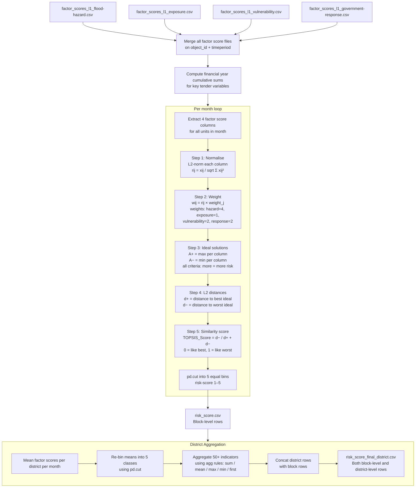

# TOPSIS Risk Score & Final Output — Methodology

**Script:** `RiskScoreModel/scripts/topis_riskscore_district.py`
**TOPSIS class:** `RiskScoreModel/scripts/topsis.py`
**Input:** All four `factor_scores_l1_*.csv` files (merged)
**Outputs:**
- `RiskScoreModel/data/risk_score.csv` — block-level risk score
- `RiskScoreModel/data/risk_score_final_district.csv` — platform-ready output (blocks + district summaries)

---

## Purpose

TOPSIS (Technique for Order of Preference by Similarity to Ideal Solution) is a multi-criteria decision analysis method that produces a single composite risk score from the four factor scores. It ranks each geographic unit relative to an ideally worst and ideally best scenario, with user-configurable weights for each factor. The output is then aggregated to district level and packaged into the final CSV that feeds the IDS-DRR online platform.

**Score interpretation:** 1 = Lowest composite risk, 5 = Highest composite risk.

---

## Full Pipeline



---

## TOPSIS Algorithm Detail

The TOPSIS class (`topsis.py`) implements the standard 6-step algorithm:

### Step 1 — Evaluation Matrix

Input matrix: rows = geographic units, columns = 4 factor scores.

```
X = [[hazard, exposure, vulnerability, government-response], ...]
```

### Step 2 — Normalise

Each column is normalised by its vector norm:

```
r_ij = x_ij / sqrt(Σ_i x_ij²)
```

### Step 3 — Weighted Normalised Matrix

Each normalised value is multiplied by the column's weight:

```
v_ij = w_j × r_ij
```

Default weights:

| Factor | Weight | Rationale |
|--------|--------|-----------|
| `flood-hazard` | **4** | Primary driver of flood risk |
| `vulnerability` | **2** | Structural conditions amplify hazard impact |
| `government-response` | **2** | Response capacity mitigates risk |
| `exposure` | **1** | Population at risk; context factor |

> Weights are set as integer literals in `topis_riskscore_district.py` (`fldhzd_w`, `exp_w`, `vul_w`, `resp_w`). The weightages are defined using the document “Disaster Risk and Resilience in India” drafted by the Ministry of Home Affairs and UNDP. 

### Step 4 — Ideal Solutions

Since all criteria are coded "more = more risk" (including government-response, which is inversely coded in its own script):

```
A+ (best ideal)  = max of each column (highest risk scenario)
A− (worst ideal) = min of each column (lowest risk scenario)
```

> `criterias = [True, True, True, True]` — all set to benefit criteria (higher = closer to worst).

### Step 5 — L2 Distances

```
d+_i = sqrt(Σ_j (v_ij − A+_j)²)   # distance to best (worst case)
d−_i = sqrt(Σ_j (v_ij − A−_j)²)   # distance to worst (best case)
```

### Step 6 — Similarity Score

```
TOPSIS_Score_i = d−_i / (d+_i + d−_i)
```

Score ranges from 0 (most similar to best ideal = lowest risk) to 1 (most similar to worst ideal = highest risk).

### Classification

```python
risk-score = pd.cut(TOPSIS_Score, bins=5, labels=[1,2,3,4,5])
```

Equal-width bins divide the 0–1 range into 5 risk classes.

---

## District Aggregation

After block-level scoring, district-level summaries are computed by grouping on `(district, timeperiod)`:

| Variable type | Aggregation |
|---------------|-------------|
| Tender values (total, by scheme) | `sum` across blocks |
| Population, household counts | `sum` |
| Percentages, densities, indices | `mean` |
| Rainfall max | `max` |
| River level min/max | `min` / `max` |
| Factor scores (hazard, exposure, vulnerability, response) | `mean` then re-binned with `pd.cut` |
| TOPSIS score | `mean` |
| Risk score | `mean` then re-binned with `pd.cut` |

District rows are concatenated with the original block rows into a single file. Rows are distinguished by whether the `district` field matches the `block_name` field (district rows have them equal, block rows have a specific block name).

---

## Input Requirements

### Factor Score Columns

All four must be present, either merged or loadable from separate files:

| Column | Type | Source |
|--------|------|--------|
| `flood-hazard` | Integer (1–5) | `factor_scores_l1_flood-hazard.csv` |
| `exposure` | Integer (1–5) | `factor_scores_l1_exposure.csv` |
| `vulnerability` | Integer (1–5) | `factor_scores_l1_vulnerability.csv` |
| `government-response` | Integer (1–5) | `factor_scores_l1_government-response.csv` |
| `object_id` | Integer | Unique geographic unit ID |
| `timeperiod` | String `YYYY_MM` | Month identifier |
| `district` | String | Parent district name |

### District ID Lookup

**File:** `RiskScoreModel/assets/district_objectid.csv`

Required for joining district-level aggregations to geographic IDs. Must contain:

| Column | Description |
|--------|-------------|
| `district` | District name matching the master data |
| `object_id` | Corresponding district-level object ID for the platform |

### Indicator Variables (optional)

The 50+ raw indicator columns from `MASTER_VARIABLES.csv` are carried through and aggregated to district level for the platform's drill-down display. These are listed in the `indicators` and `aggregation_rules` dictionaries in `topis_riskscore_district.py`. Remove or add columns as appropriate for a new geography.

---

## Output Schema

### `risk_score.csv` (Block-level)

Contains all merged factor score data plus:

| Column | Type | Description |
|--------|------|-------------|
| `TOPSIS_Score` | Float (0–1) | Raw TOPSIS similarity score |
| `risk-score` | Integer (1–5) | Composite risk class |
| `financial-year` | String | Fiscal year label |
| `*-fy-cumsum` | Float | Financial year cumulative tender values |

All column names are lowercased and hyphenated (`snake_case` → `kebab-case`).

### `risk_score_final_district.csv` (Platform output)

Contains both block-level rows and district-level summary rows, with:

- All columns from `risk_score.csv`
- District-aggregated factor scores and indicators
- `total-infrastructure-damage` = `total-house-fully-damaged` + `roads` + `bridge`
- `inundation-pct` expressed as percentage (× 100)
- Rounding applied per column (see `rounding_rules` dict in script)

---

## Adapting for a New Geography

| Element | What to change |
|---------|---------------|
| Factor weights | Edit `fldhzd_w`, `exp_w`, `vul_w`, `resp_w` in `topis_riskscore_district.py` |
| Number of risk classes | Change `bins=5` in `pd.cut` |
| District lookup | Replace `assets/district_objectid.csv` with local district IDs |
| Indicator columns | Update `indicators` list and `aggregation_rules` dict to match available columns |
| Fiscal year logic | Update `get_financial_year()` function for local fiscal year calendar |
| Column rename | Update `rename(columns=...)` calls for local variable name conventions |
