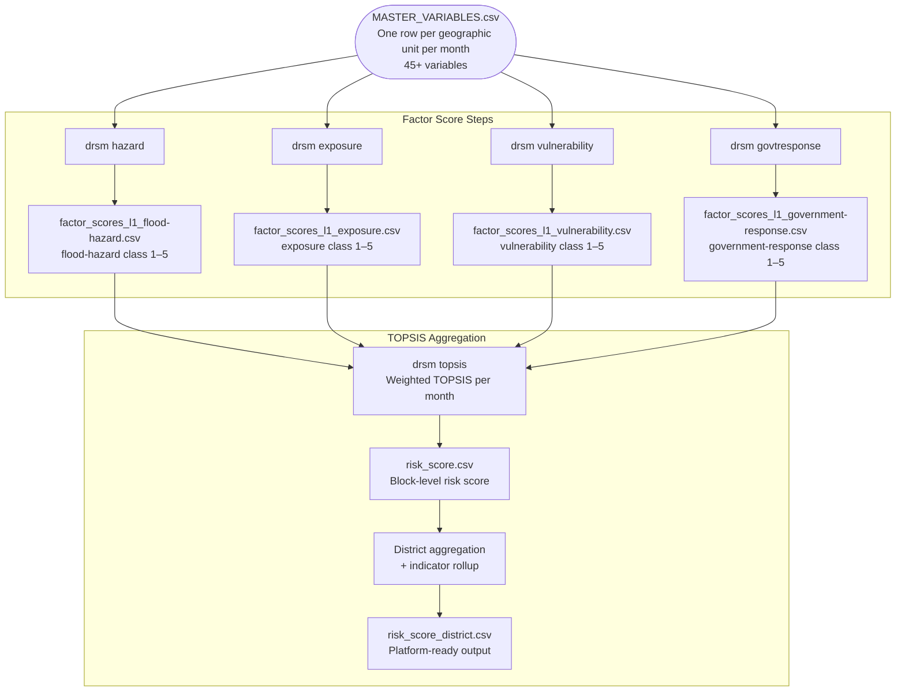

# IDS-DRR Risk Score Model — Methodology Documentation

This directory documents the **scoring methodology** for the IDS-DRR risk model. These files are intended for DPGA certification and for implementers who want to adapt the model to a new geography or data source.

The model takes a master dataset of spatial variables (one row per geographic unit per month) and produces a composite flood risk score using four factor scores combined via TOPSIS.

---

## Repository Context

```
risk-score-model-generic/
├── disaster_risk_score_model/  ← installable library: scoring modules, CLI,
│                                  config loader, bundled config templates
├── contrib/india/  ← India-specific tooling and the Assam reference example
└── docs/           ← THIS DIRECTORY — methodology documentation
```

> Configurable thresholds and variable lists live in the two TOML files that
> `drsm init-config` scaffolds (`scores_config.toml`, `topsis_config.toml`).

> **Source data documentation** (how raw datasets are ingested and transformed into `MASTER_VARIABLES.csv`) lives in the companion repository:
> `flood-data-ecosystem-generic/docs/`

---

## Full Pipeline Overview



---

## Document Index

Start here:

- [getting_started.md](./getting_started.md) — end-to-end guide for adapting the model to a new geography

Per-factor methodology:

| File | Score | Method | Command |
|------|-------|--------|--------|
| [score_hazard.md](./score_hazard.md) | Flood Hazard | Log-normalise + z-score + quantile bins | `drsm hazard` |
| [score_exposure.md](./score_exposure.md) | Exposure | MinMax scale + std-dev bins | `drsm exposure` |
| [score_vulnerability.md](./score_vulnerability.md) | Vulnerability | DEA (CRS) efficiency + Jenks breaks | `drsm vulnerability` |
| [score_government_response.md](./score_government_response.md) | Government Response | FY cumulative sum + MinMax + std-dev bins | `drsm govtresponse` |
| [topsis_risk_score.md](./topsis_risk_score.md) | Composite Risk | Weighted TOPSIS + district rollup | `drsm topsis` |

---

## Common Input Requirements

All factor score scripts read from a single master CSV:

**File:** `data/MASTER_VARIABLES.csv`

**Minimum required columns for all scripts:**

| Column | Type | Description |
|--------|------|-------------|
| `unit_id` | String | Stable unique identifier for a geographic unit (any scheme; need not be numeric) |
| `time_period` | String | Month in `YYYY-MM` format |
| `parent_unit` | String | Parent unit name each row rolls up to |
| *(factor-specific variables)* | Float | See individual score docs |

**Geographic unit:** Any consistent administrative unit (block, sub-district, revenue circle, etc.) that has a unique `unit_id` and can be mapped to a `parent_unit` for aggregation.

**Temporal unit:** Monthly. The model runs independently per month, so time series length is flexible.

---

## Output Files

| File | Description |
|------|-------------|
| `factor_scores_l1_flood-hazard.csv` | Master variables + `flood-hazard` (1–5) + `flood-hazard-float` |
| `factor_scores_l1_exposure.csv` | Master variables + `exposure` (1–5) |
| `factor_scores_l1_vulnerability.csv` | Master variables + `vulnerability` (1–5) + `efficiency` |
| `factor_scores_l1_government-response.csv` | Master variables + `government-response` (1–5) |
| `risk_score.csv` | All factor scores + `topsis-score` + `risk-score` (1–5), block level |
| `risk_score_district.csv` | Block rows + district summary rows; platform-ready for IDS-DRR |
