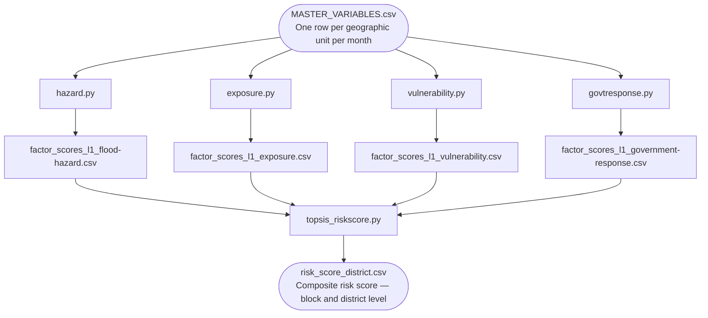

# Getting Started — Adapting the Model to a New Geography

This guide walks through everything required to run the risk score model for a new geography, from collecting input data to producing the final composite risk score.

For methodology detail on any individual score, see the [document index](./README.md).

---

## Pipeline Overview



The four factor scripts are independent of each other and can run in any order. The TOPSIS script must run after all four have completed.

---

## Step 1 — Collect Your Input Data

All scripts read from a single master CSV file:

**`data/MASTER_VARIABLES.csv`**

One row per geographic unit per month. The following columns are required by every script:

| Column | Type | Description |
|--------|------|-------------|
| `object_id` | String | Unique identifier for each geographic unit|
| `timeperiod` | String (`YYYY_MM`) | Month identifier, e.g. `2022_07` |
| `district` | String | Parent district name for each unit |

Note: `object_id` can be any stable, unique identifier for a geographic unit — it does not need to follow any national coding scheme. The only requirements are that it is unique per unit and consistent across all input files and time periods. (For an example of a national scheme, the India reference example derives `object_id` from the LGD code system in the format `AA-BBB-CCCCC` — state, district, subdistrict; see [`contrib/india/example/`](../contrib/india/example/).)

In addition, each factor score requires its own input variables. The table below shows the default variables and the minimum viable set for each factor:

### Hazard

| Column | Description | Min. requirement |
|--------|-------------|-----------------|
| `inundation_intensity_mean_nonzero` | Mean flood inundation intensity | Any measure of flood water extent or depth |
| `inundation_intensity_sum` | Cumulative inundation intensity | Any cumulative flood exposure measure |
| `drainage_density` | Stream length per unit area | km/km² or equivalent |
| `mean_rain` | Mean rainfall in the unit | mm or consistent unit |
| `max_rain` | Maximum rainfall pixel value | mm or consistent unit |

**Minimum viable:** any 2 or more of the above. See [score_hazard.md](./score_hazard.md) for alternative data sources.

### Exposure

| Column | Description | Min. requirement |
|--------|-------------|-----------------|
| `total_population` | Total estimated population | Any population count |
| `total_households` | Total number of households | Any household count |

**Minimum viable:** 1 variable. See [score_exposure.md](./score_exposure.md) for alternative data sources.

### Vulnerability

Requires two groups of variables:

**Condition inputs** (structural characteristics):

| Column | Description |
|--------|-------------|
| `mean_sex_ratio` | Females per 1,000 males |
| `schools_count` | Schools per administrative unit |
| `health_centres_count` | Health centres per administrative unit |
| `rail_length` | Rail track length per administrative unit |
| `road_length` | Road length per administrative unit |
| `net_sown_area_ha` | Agricultural sown area |
| `electricity_access` | Electricity access score (0–1) |
| `piped_water_households_pct` | Percentage of households with piped water |
| `no_sanitation_households_pct` | Percentage of households without sanitation |
| `elderly_population` | Elderly population per administrative unit |
| `flood_protection_failures` | Failures of flood-protection structures per administrative unit |

**Damage outputs** (observed flood impacts):

| Column | Description |
|--------|-------------|
| `human_lives_lost` | Deaths per capita |
| `population_affected_total` | Affected population per capita |
| `crop_area` | Damaged crop area / total sown area |
| `flood_protection_damaged` | Damage to flood-protection structures per km² |
| `roads_damaged` | Road damage per km² |
| `bridges_damaged` | Bridge damage per km² |

> **If damage data is not available:** The DEA method used for vulnerability scoring requires observed damage data to function correctly. Without it, consider replacing the DEA with a simpler weighted index over the condition variables. See [score_vulnerability.md](./score_vulnerability.md) for detail.

See [score_vulnerability.md](./score_vulnerability.md) for alternative data sources.

### Government Response

| Column | Description | Min. requirement |
|--------|-------------|-----------------|
| `total_procurement_value` | Total value of all flood-related contracts awarded | Any measure of total disaster-related procurement |
| `disaster_fund_sanctions_value` | Value of disaster-fund sanctions | Disaster-fund disbursements or equivalent |
| `disaster_fund_procurement_value` | Value of scheme-specific contracts | Optional; can be omitted |

**Minimum viable:** 1 variable representing total government flood expenditure. See [score_government_response.md](./score_government_response.md) for alternative data sources including OCDS-format procurement data. (These generic column names are placeholders — the India example uses scheme-specific names such as `SDRF_sanctions_awarded_value`.)

### District ID Lookup

**`data/district_objectid.csv`**

Maps district names to the platform's geographic IDs. Required by the TOPSIS script for district-level aggregation. Must contain:

| Column | Description |
|--------|-------------|
| `district` | District name matching the values in `MASTER_VARIABLES.csv` |
| `object_id` | Platform-level object ID for that district |

---

## Step 2 — Configure the Project

All configuration lives in TOML files under `config/`. You do not need to edit any Python scripts to adapt the model — only the TOML files.

### `config/base_config.toml`

Always review this first. It sets the shared paths and column names used by every script.

| Setting | Default | Change if... |
|---------|---------|-------------|
| `paths.data_folder` | `data` | Your data folder is named differently |
| `paths.input_file` | `MASTER_VARIABLES.csv` | Your input file has a different name |
| `columns.time_column` | `timeperiod` | Your time column has a different name |
| `columns.object_id_column` | `object_id` | Your geographic ID column is named differently |
| `columns.district_column` | `district` | Your parent-unit (aggregation) column is named differently |

### `config/hazard_config.toml`

| Setting | Default | Change if... |
|---------|---------|-------------|
| `inputs.variables` | 5 rainfall/inundation columns | You have different or fewer hazard variables |
| `classification.quantile_thresholds` | `[0.35, 0.60, 0.80, 0.95]` | You want different classification boundaries |
| `classification.classes` | `[1, 2, 3, 4, 5]` | You want a different number of risk classes |

### `config/exposure_config.toml`

| Setting | Default | Change if... |
|---------|---------|-------------|
| `inputs.variables` | `total_population`, `total_households` | You have different population/household columns (min: 1) |
| `classification.classes` | `[1, 2, 3, 4, 5]` | You want different class labels |

### `config/vulnerability_config.toml`

| Setting | Default | Change if... |
|---------|---------|-------------|
| `inputs.condition_vars` | 11 infrastructure/demographic columns | You have different structural condition variables |
| `inputs.damage_vars` | 6 flood damage columns | You have different damage variables (or none — see note below) |
| `inputs.inverted_inputs` | 6 resilience variables | You change condition_vars — update which variables are inverted |
| `inputs.neg_inputs` | 3 negative-polarity variables | You change condition_vars |
| `normalisation.per_capita` | 2 variables ÷ `total_population` | Update denominators to match your data |
| `normalisation.per_area` | 11 variables ÷ `area_sqkm` | Update denominators to match your data |
| `classification.n_classes` | `5` | You want a different number of vulnerability classes |
| `classification.damage_threshold` | `0.0001` | You want to change the damage significance threshold |

> **If damage data is not available:** The DEA method requires observed damage data. Without it, consider replacing the DEA with a simpler weighted index over `inputs.condition_vars` only.

### `config/govtresponse_config.toml`

| Setting | Default | Change if... |
|---------|---------|-------------|
| `inputs.variables` | 3 generic procurement/fund columns | You have different expenditure columns (min: 1) |
| `fiscal_year.start_month` | `1` (January / calendar year) | Your geography uses a different fiscal year calendar (the India example uses `4`) |

### `config/topsis_config.toml`

| Setting | Default | Change if... |
|---------|---------|-------------|
| `weights.*` | hazard=4, exposure=1, vulnerability=2, response=2 | You want to re-weight factors based on local context or policy |
| `classification.n_bins` | `5` | You want a different number of output risk classes |
| `paths.district_lookup_file` | `data/district_objectid.csv` | You replace the district ID lookup |
| `[indicators]` | Generic columns with aggregation rules | Add/remove rows to match the columns in your data (missing ones are ignored) |
| `[rounding]` | Per-column decimal precision | You want different output rounding |

Column references in this file are written in `snake_case`; the final output columns
are lowercased and hyphenated to `kebab-case` automatically.

---

## Step 3 — Run the Scripts

All scripts should be run from the repository root. By default the scripts read
their configuration from `config/`. To run an alternative config set without
editing the defaults — for example the bundled India reference example — set the
`RISK_MODEL_CONFIG_DIR` environment variable to the directory containing your
config files:

```bash
export RISK_MODEL_CONFIG_DIR=contrib/india/example/config   # optional
```

The four factor scripts are independent and can run in any order (or in parallel):

```bash
python scripts/hazard.py
python scripts/exposure.py
python scripts/vulnerability.py
python scripts/govtresponse.py
```

Once all four have completed, run the TOPSIS aggregation:

```bash
python scripts/topsis_riskscore.py
```

---

## Step 4 — Validate Your Outputs

After running all scripts, the following files should be present in `data/`:

| File | What to check |
|------|--------------|
| `factor_scores_l1_flood-hazard.csv` | `flood-hazard` column present; values in range 1–5; all 5 classes represented |
| `factor_scores_l1_exposure.csv` | `exposure` column present; values in range 1–5 |
| `factor_scores_l1_vulnerability.csv` | `vulnerability` column present; values in range 1–5; `efficiency` column in range 0–1 |
| `factor_scores_l1_government-response.csv` | `government-response` column present; values in range 1–5 |
| `risk_score.csv` | `risk-score` and `topsis-score` columns present; no missing values |
| `risk_score_district.csv` | Contains both block-level and district-level rows |

The hazard script also saves a diagnostic plot (`data/hazard_distribution.png`) showing the class distribution — a roughly decreasing distribution (more low-risk units than high-risk) is expected.

If any factor score shows only 1–2 classes represented, it usually indicates that the input variable has very low variance for that geography or time period. Review the input data distribution for that factor.
